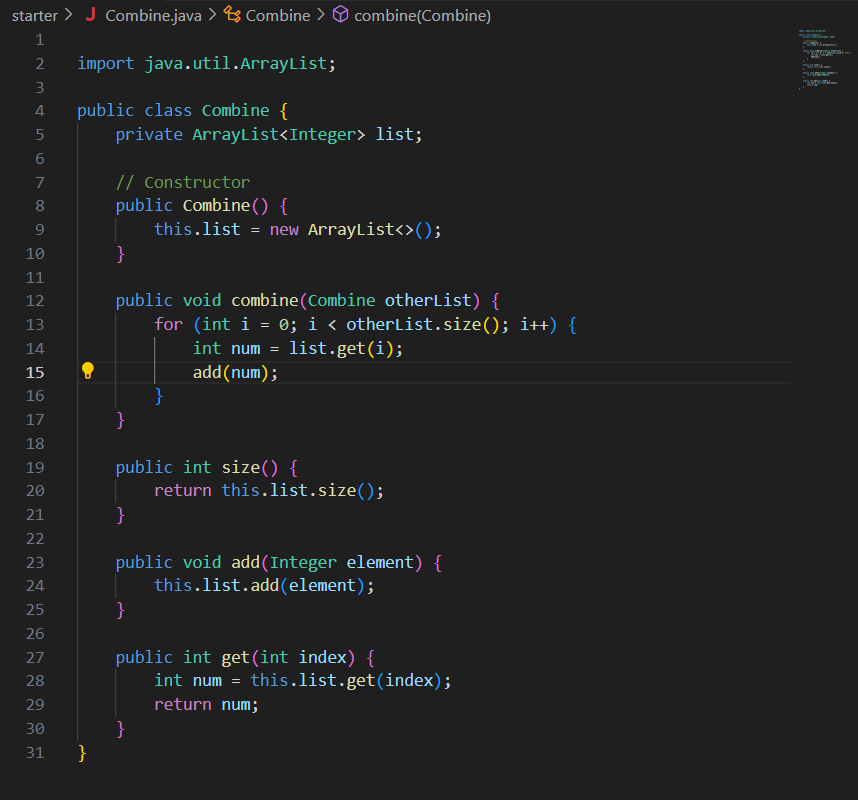
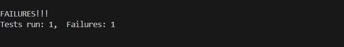
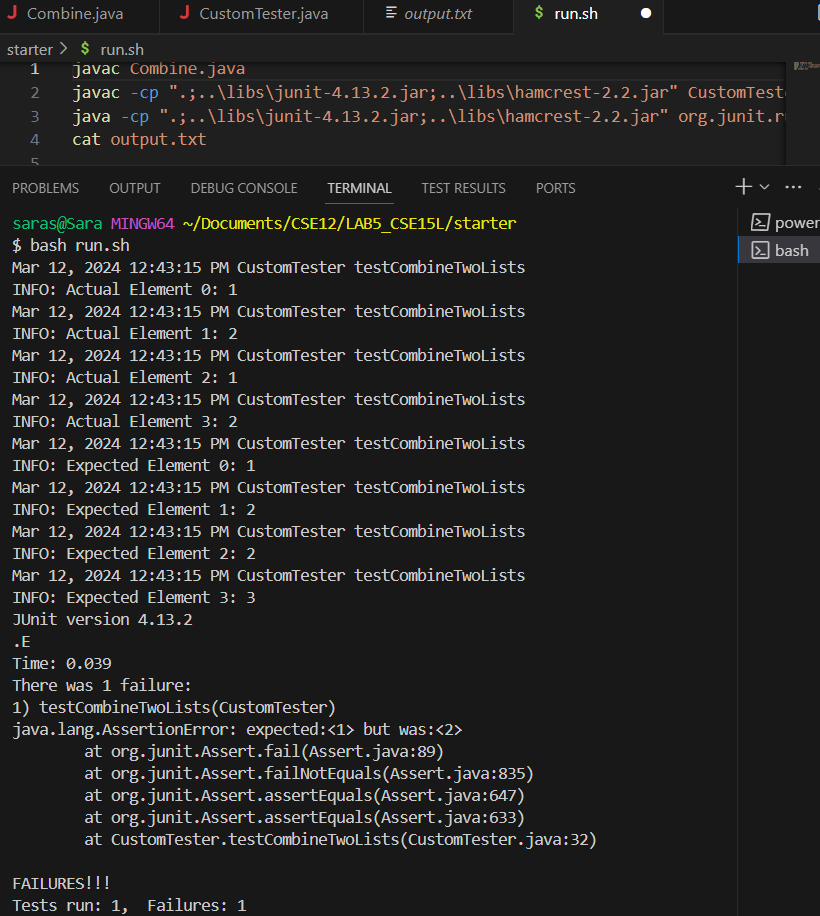

# Lab Report 5
By: Sara Standlee
## Part 1 - Debugging Scenario
* The original post from a student with a screenshot showing a symptom and a description of a guess at the bug/some sense of what the failure-inducing input is.
   * Hello. My test for my Combine method is failing. My method aims to combine two lists. However, I recieve the failure message. 
   * 
   * 


* A response from a TA asking a leading question or suggesting a command to try
  * Try printing the failure message out to the terminal and looking at what the message failure says. Also, try printing what the expected list is and what the actual list is. Where is the failure stemming from?

* Another screenshot/terminal output showing what information the student got from trying that, and a clear description of what the bug is.
   * The failure message describes how 2 is expected, but 1 was the actual value. Printing the expected and actual values clearly indicates that the variable `list` should be the values [1,2,2,3], but was actually [1,2,1,2]. This suggests that the method `combine` is not combining two separate lists as intended by the method, but instead combining one list with the contents of itself. Then, looking at the original code the student submitted for the method `combine`, we can see that on line 14, the student uses `list` instead of `otherList`. This confirms what we expected. Instead of adding the elements from `otherlist` to `list`, the method was adding `list` to `list`, resulting in the failure. 
   * 

* All the information needed about the setup:
  * The file & directory structure needed
    * We have three files relevant to our bug. The first is the file `Combine.java`, which holds our buggy method. The second is the file `CustomTester.java`, which holds the test that is failing when running our buggy method. And the third is the bash script `run.sh` which holds the commands that compile and run the files, saves it to a file, and prints this file (with the results of the test) into our terminal. All three of these are held in the directory `starter`, which is located in the overall directory `LAB5_CSE15L`. This overall directory also holds the jUnit jar files.
    ```
     saras@Sara MINGW64 ~/Documents/CSE12/LAB5_CSE15L
     $ ls
     imgur/  lib/  libs/  starter/
     
     saras@Sara MINGW64 ~/Documents/CSE12/LAB5_CSE15L
     $ ls starter/
     Combine.class  CustomTester.class  output.txt
     Combine.java   CustomTester.java   run.sh
    ```
  * The contents of each file before fixing the bug
     * The content of the run.sh script remains the same before and after fixing the bug:
    ```
    javac Combine.java
    javac -cp ".;..\libs\junit-4.13.2.jar;..\libs\hamcrest-2.2.jar" CustomTester.java
    java -cp ".;..\libs\junit-4.13.2.jar;..\libs\hamcrest-2.2.jar" org.junit.runner.JUnitCore CustomTester > output.txt
    cat output.txt
    ```
     * The content of the CustomTester.java before fixing the bug:
     ```
     import org.junit.Test;
     import static org.junit.Assert.*;
     
     public class CustomTester {
             @Test(timeout = 500)
             public void testCombineTwoLists() {
               Combine list = new Combine();
               Combine list2 = new Combine();
               list.add(1);
               list.add(2);
               list2.add(2);
               list2.add(3);
               list.combine(list2);
               Combine combinedList = new Combine();
               combinedList.add(1);
               combinedList.add(2);
               combinedList.add(2);
               combinedList.add(3);
               for (int i = 0; i < list.size(); i++) {
                   assertEquals(list.get(i), combinedList.get(i));
               }
             }      
     }
     ```
     * The content of CustomTester.java after fixing the bug:
     ```
     import org.junit.Test;
     
     import static org.junit.Assert.*;
     import java.util.logging.Logger;
     
     public class CustomTester {
             private static final Logger logger = Logger.getLogger(CustomTester.class.getName());
     
             @Test(timeout = 500)
             public void testCombineTwoLists() {
               Combine list = new Combine();
               Combine list2 = new Combine();
               list.add(1);
               list.add(2);
               list2.add(2);
               list2.add(3);
               list.combine(list2);
               Combine combinedList = new Combine();
               combinedList.add(1);
               combinedList.add(2);
               combinedList.add(2);
               combinedList.add(3);
               //print the actual value
               for (int i = 0; i < list.size(); i++) { 
                   logger.info("Actual Element "+ i + ": " + list.get(i));
               }
               //print the expected value
               for (int i = 0; i < list.size(); i++) {
                 logger.info("Expected Element "+ i + ": " + combinedList.get(i));
               } 
               for (int i = 0; i < list.size(); i++) {
                   assertEquals(list.get(i), combinedList.get(i));
               }
             }     
     }
     ```
     * The content of Combine.java before fixing the bug:
     ```      
     import java.util.ArrayList;
     
     public class Combine {
         private ArrayList<Integer> list;  
     
         // Constructor
         public Combine() {
             this.list = new ArrayList<>();
         }
     
         public void combine(Combine otherList) {
             for (int i = 0; i < otherList.size(); i++) {
                 int num = list.get(i);
                 add(num);
             }
         }
     
         public int size() {
             return this.list.size();
         }
     
         public void add(Integer element) {
             this.list.add(element);
         }
     
         public int get(int index) {
             int num = this.list.get(index);
             return num;
         }
     }
     ```
     * The content of Combine.java after fixing the bug:
     ```     
     import java.util.ArrayList;
     
     public class Combine {
         private ArrayList<Integer> list;  
     
         // Constructor
         public Combine() {
             this.list = new ArrayList<>();
         }
     
         public void combine(Combine otherList) {
             for (int i = 0; i < otherList.size(); i++) {
                 int num = otherList.get(i);  //this line was fixed
                 add(num);
             }
         }
     
         public int size() {
             return this.list.size();
         }
     
         public void add(Integer element) {
             this.list.add(element);
         }
     
         public int get(int index) {
             int num = this.list.get(index);
             return num;
         }
     }
     ```

  * The full command line (or lines) you ran to trigger the bug
    * The command lines run to trigger the bug was `bash run.sh`. This runs the bash script. The commands in the bash script are below. These comands compile the `Combine.java` file and the `CustomTester.java` file, saves the output to a file called `output.txt`, then prints this output into the terminal. Running the `CustomTester.java` file triggered the bug, as it had the code that showed the wrong actual output vs the expected output.
    ```
    javac Combine.java
    javac -cp ".;..\libs\junit-4.13.2.jar;..\libs\hamcrest-2.2.jar" CustomTester.java
    java -cp ".;..\libs\junit-4.13.2.jar;..\libs\hamcrest-2.2.jar" org.junit.runner.JUnitCore CustomTester > output.txt
    cat output.txt
    ```

  * Description of what to edit to fix the bug
     * Line 14 in the java file `Combine.java` needs to be changed from `int num = list.get(i);` to `int num = otherList.get(i);`. This makes it so that the contents from `otherList` are being added to `list`, which is now the combined list of the two methods, as desired. 


## Part 2 - Reflection
In the second half of the quarter, I personally found vim to be cool to learn about. Before this lab, I was not familiar with navigating a system through the command line. Thus, I've found the tools, specifically how to navigate through files and directories at the command line, to be useful. However, I had wondered how we could change a file from the command line. Learning about vim had answered my question. I also found the shortcuts we learned through vimtutor to be interested to learn and memorize. 
