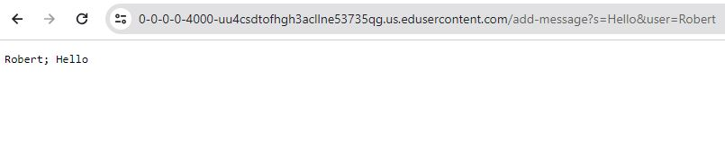
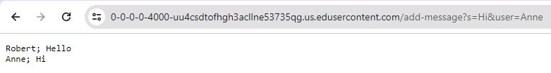

# Lab Report 2
By: Sara Standlee
## Part 1
Below is the code for a web server called `ChatServer`. There are four java classes for this server. \ 
First, in the ChatServer.java file, we have:

```
import java.io.IOException;
import java.net.URI;

class Handler implements URLHandler {
    // Create final string using StringBuilder
    StringBuilder stringBuilder = new StringBuilder();

    public String handleRequest(URI url) { 
        if (url.getPath().equals("/")) {
            return this.stringBuilder.toString();
        } 
        // The request looks like this: add-message?s=<string>&user=<string>
        else if (url.getPath().contains("/add-message")) {
            // Two elements s=<string> and user=<string>
            String[] parameters = url.getQuery().split("&");
            // Separate s=<string>
            String[] sAndString = parameters[0].split("=");
            // Assign <string> to s
            String s = sAndString[1];
            // Separate user=<string>
            String[] userAndString = parameters[1].split("=");
            // Assign the <string> to user
            String user = userAndString[1];
            // Create String <user>: <message>
            String combinedString = user + "; " + s;

            stringBuilder.append(combinedString).append("\n");            

            return this.stringBuilder.toString();
        }
        else {
            return "404 Not Found!";
        }
    }
}

class ChatServer {
    public static void main(String[] args) throws IOException {
        if(args.length == 0){
            System.out.println("Missing port number! Try any number between 1024 to 49151");
            return;
        }

        int port = Integer.parseInt(args[0]);

        Server.start(port, new Handler());
    }
}
```
Next, in the Server.java file, we have:
```
// A simple web server using Java's built-in HttpServer
import java.io.IOException;
import java.io.OutputStream;
import java.net.InetSocketAddress;
import java.net.URI;

import com.sun.net.httpserver.HttpExchange;
import com.sun.net.httpserver.HttpHandler;
import com.sun.net.httpserver.HttpServer;

interface URLHandler {
    String handleRequest(URI url);
}

class ServerHttpHandler implements HttpHandler {
    URLHandler handler;
    ServerHttpHandler(URLHandler handler) {
      this.handler = handler;
    }
    public void handle(final HttpExchange exchange) throws IOException {
        // form return body after being handled by program
        try {
            String ret = handler.handleRequest(exchange.getRequestURI());
            // form the return string and write it on the browser
            exchange.sendResponseHeaders(200, ret.getBytes().length);
            OutputStream os = exchange.getResponseBody();
            os.write(ret.getBytes());
            os.close();
        } catch(Exception e) {
            String response = e.toString();
            exchange.sendResponseHeaders(500, response.getBytes().length);
            OutputStream os = exchange.getResponseBody();
            os.write(response.getBytes());
            os.close();
        }
    }
}

public class Server {
    public static void start(int port, URLHandler handler) throws IOException {
        HttpServer server = HttpServer.create(new InetSocketAddress(port), 0);

        //create request entrypoint
        server.createContext("/", new ServerHttpHandler(handler));

        //start the server
        server.start();
        System.out.println("Server Started!");
    }
}
```

Two screenshorts using the /add-message: \

In this screenshot, the `handleRequest()` method is called. \
The relevant argument for the `handleRequest()` method is a url. As seen in the image, the url path `add-message?s=Hello&user=Robert` is used, and this is the argument for the method in this case. To keep track of the overall String to display, I used the class field `StringBuilder stringBuilder = new StringBuilder();`. This keeps track of all the Strings created from the user input from the url.  \
The values of this field had changed with the request in the url. It had gone from empty to containing the String `"Robert: Hello"`. 



In this screenshot, the `handleRequest()` method is once again called. \
Same as before, the relevant argument for the `handleRequest()` method is a url. As seen in the image, the url path `add-message?s=Hi&user=Anne` is used, and this is the argument for the `handleRequest()` method in this case. Once again, to keep track of the overall String to display, I used the class field `StringBuilder stringBuilder = new StringBuilder();`. This keeps track of all the Strings created from the user input from the url. Notice that since `add-message?s=Hello&user=Robert` had been inputted into the url before the `add-message?s=Hi&user=Anne`, the class field `stringBuilder` already contained `"Robert: Hello"`. Since the url contains the add method, the code in the if-statement within the handRequest method (that senses if the url containst `"/add-message"`) runs. The String `"Anne: Hi"` is appended to the class field stringBuilder on a new line, the updated stringBuilder is returned, as can be seen in the screenshot. \
The values of the stringBuilder field had changed with the request in the url. It had gone from just containing `Robert: Hello" to also containing the String `"Anne: Hi"`, on a new line.  


## Part 2


