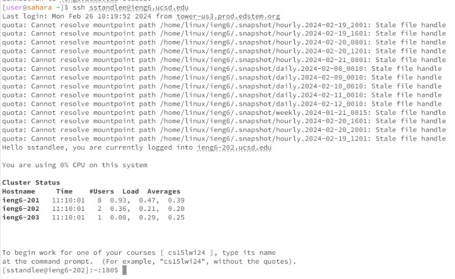
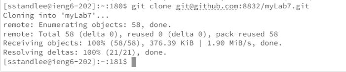
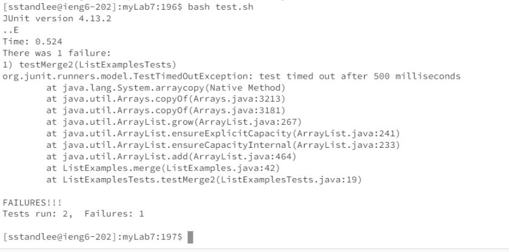
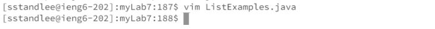
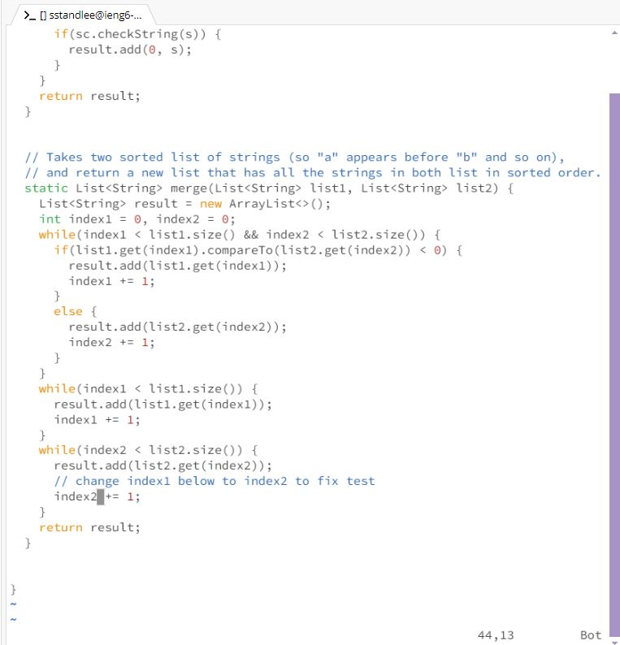
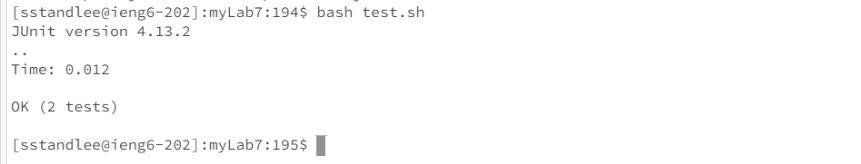
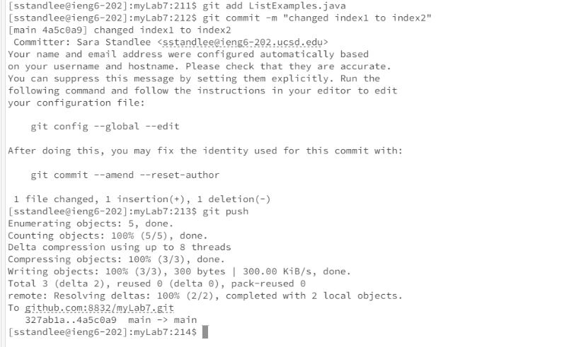

# Lab Report 4
* Step 4: Log into ieng6 \
  Keys Pressed: `<up><enter>`. The `ssh sstandlee@ieng6.ucsd.edu` command was one up in my history, so I used the arrow key to access it. This command logs me into my ieng6 machine. \
  

  
* Step 5: Clone your fork of the repository from your Github account (using the SSH URL) \
  Keys Pressed: `git<space>clone<space><ctrl><v>`. This is the command `git clone git@github.com:8832/myLab7.git`. This command clones my forked repository of lab7, which I named myLab7. I typed in `git clone ` then pasted the ssh URL which I had copied onto my clipboard using `<ctrl><c>` (prior to entering the command) from my github repository. \
  

  
* Step 6: Run the tests, demonstrating that they fail \
  Keys Pressed: `cd my<tab>`. This is the command `cd myLab7` and it changes directories into the myLab7/ directory. The tab key is used to complete the directory myLab7, which was a subdirectory of the current working directory before changing into myLab7. I then pressed the keys `bash<space>tes<tab>` which is the command `bash test.sh`, which runs the test.sh script. The tests are run and the output demonstrates that there is a failure. Again, the tab key was used to complete test.sh, which is a shell script located withing the current working directory.\
  

  
* Step 7: Edit the code file to fix the failing test. \
  Keys Pressed: `vim<space><ctrl><v>` This command is `vim ListExamples.java` and is used to open the file ListExamples.java in vim. Prior to this command, I had copied 'ListExamples.java' to my clipboard from the Week7 Lab instructions using `<ctrl><c>. Once in vim, I used the keys: `44j11lxi2<escape>:wq<enter>`. This navigated me down 44 lines and over 11 characters, which placed by character exactly above the '1' in 'index1'. I used `x` to delete the '1', `i` to switch to insert mode, and pressed `2` to insert '2' (which has now replaced the '1'). I then pressed `esc` to return to normal mode. Then `:wq` and then <enter> to save and exit vim. This process edits the code file to fix the failing test. \
Image1: \
    \
Image2: \
   
  
* Step 8: Run the tests demonstrating they now succeed \
  Keys Pressed: `<up><up><up><enter>` This command is `bash test.sh`, which was located three up in my command history. I used the up arrow to access this command in my history. This command runs the test.sh script, and the output demonstrates that the tests now pass. \
  
  
* Step 9: Commit and push the resulting change to your Github account. \
  Keys Pressed: `git<space>addLis<tab>.j<tab><enter>`. This is the command `git add ListExamples.java`. I used tab to complete the file name. For my second command, I pressed `git<space>commit<space>-m<space>"changed<space>index1<space>to<space>index2"`. For my third command, I pressed the keys `git<space>push`. Together, this commits and pushes the change I made to ListExamples.java to my Github Account. Going into my Github account and checking the myLab7 repository, we can see the change I made in vim is now reflected in the ListExamples.java file in the myLab7 repository on Github. \
  
