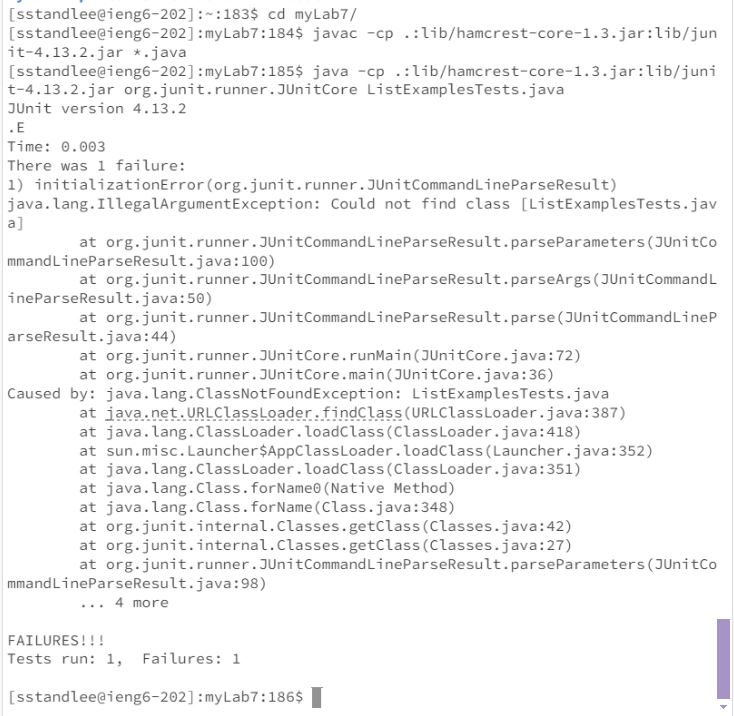

# Lab Report 4
* Step 4: Log into ieng6 \
  Keys Pressed: `<up><enter>`. The `ssh sstandlee@ieng6.ucsd.edu` command was one up in my history. This command logs me into my ieng6 machine. \
  

  
* Step 5: Clone your fork of the repository from your Github account (using the SSH URL) \
  Keys Pressed: `git<space>clone<space><ctrl><v>`. This is the command `git clone git@github.com:8832/myLab7.git`. This command clones my forked repository of lab7, which I named myLab7. I typed in `git clone ` then pasted the ssh URL which I had copied onto my clipboard using `<ctrl><c>` (prior to entering the command) from my github repository. \
  

  
* Step 6: Run the tests, demonstrating that they fail
  Keys Pressed: `<up><up><up><enter>`. This is the command `javac -cp .:lib/hamcrest-core-1.3.jar:lib/junit-4.13.2.jar *.java`. This command was three up in my history. Prior to this command, I had used the command `cd myLab7/` to change directories into the myLab7 directory. I then pressed `<up><up><up><enter>`. This is the command `java -cp .:lib/hamcrest-core-1.3.jar:lib/junit-4.13.2.jar org.junit.runner.JUnitCore ListExamplesTests.java`. It was located up three in my history. These commands are to run the jUnit tests. \
  

  
* Step 7: Edit the code file to fix the failing test. 
  Keys Pressed: `vim<space><ctrl><v>` Thisi command is `vim ListExamples.java` and is used to open the file ListExamples.java in vim. Prior to this command, I had copied 'ListExamples.java' to my clipboard from the Week7 Lab instructions. Once in vim, I used pressed the keys: `44j11lxi2<escape>:wq<enter>`. This navigated me down 44 lines and over 11 characters, which placed by character exactly above the '1' in 'index1'. I used `x` to delete the '1', `i` to switch to insert mode, and pressed `2` to insert '2' (which has now replaced the '1'). I then pressed `esc` to return to normal mode. Then `:wq` and then <enter> to save and exit vim. This process edits the code file to fix the failing test. \
   \
   \
* Step 8

  
* Step 9
